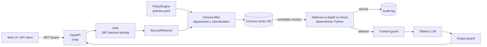
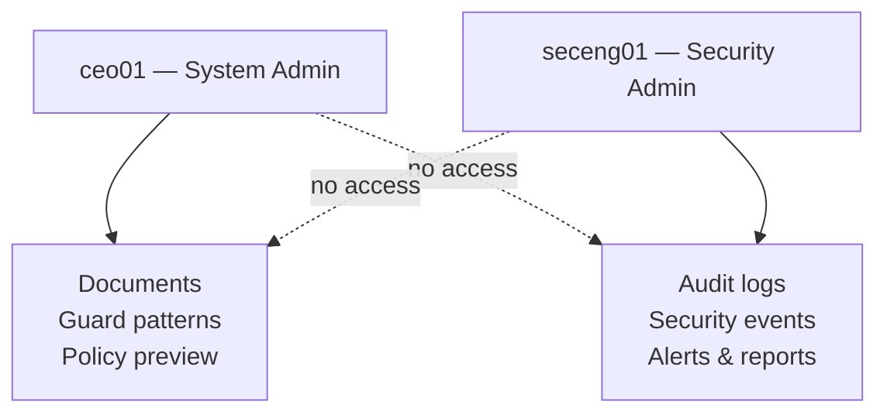
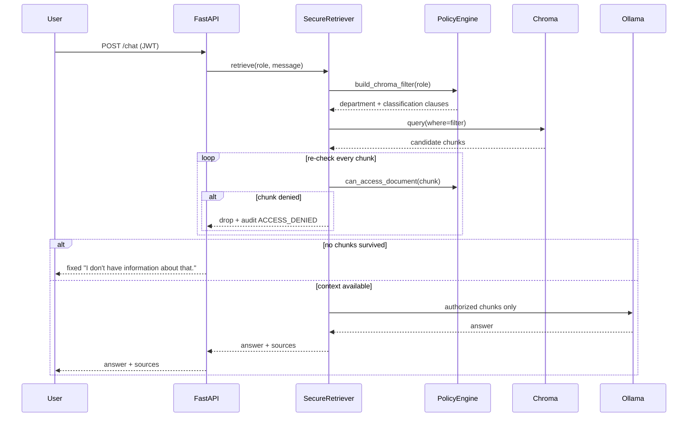

# RAGGuard

Permission-aware RAG backend. RAGGuard sits between users and an LLM and **guarantees that a document a user isn't authorized to see never enters that LLM's context** — not "the LLM was told not to repeat it," but "the retriever never fetched it in the first place."

Authorization is evaluated by deterministic Python code against a JWT-derived identity — never by the LLM and never by a role the user claims in their message text.

> Core principle: **Unauthorized information must never enter the LLM context.**

Built from `plan(2).md` (the concrete build plan) — RBAC+ABAC policy engine, secure ingestion, defense-in-depth retrieval, heuristic prompt-injection / output-leak guards, and full audit logging.

---

## Architecture



The request path is simple by design: **authorization happens before the LLM, never inside it.**

1. The JWT is the only source of identity — there is no role/department field in the chat request body.
2. `PolicyEngine` turns the role into a Chroma `where` filter, so the vector DB itself only returns documents the role may see.
3. Every returned chunk is re-validated in plain Python (defense-in-depth), and denied chunks are audited.
4. Only surviving chunks reach the LLM context — then the output guard scans the answer before it returns to the client.

---

## Quickstart (Fedora)

```bash
python3.12 -m venv .venv
source .venv/bin/activate
pip install -r requirements.txt

cp .env.example .env    # then set a real JWT_SECRET_KEY
python scripts/seed_data.py            # departments, roles, 8 demo users
python scripts/ingest_documents.py     # embeds data/sample_docs into Chroma

python run.py    # starts on HOST/PORT from .env (default 127.0.0.1:8000)
# → http://localhost:<PORT>  (UI)   ·   /docs  (Swagger)
```

The server host/port live in `.env` (`HOST`, `PORT`) — change them there, no code edits needed. Or run `uvicorn app.main:app --reload --port 8010` to override on the command line.

Ollama must be running with the configured model (`qwen2:1.5b` by default):

```bash
ollama pull qwen2:1.5b
```

## Demo users

Every user's password is `Password123!`.

| Username      | Role               | Home dept | Can see (per YAML policy) |
|---------------|--------------------|-----------|---------------------------|
| `ceo01`       | ceo (system admin) | executive | everything (TOP_SECRET)   |
| `cfo01`       | cfo                | finance   | finance, hr, executive, general (PUBLIC) |
| `cto01`       | cto                | it        | it, security, executive, general (PUBLIC) |
| `hr01`        | hr_manager         | hr        | hr, general (PUBLIC)      |
| `seceng01`    | security_engineer (security admin) | security | security, general (PUBLIC) |
| `iteng01`     | it_engineer        | it        | it, general (PUBLIC)      |
| `accountant01`| accountant         | finance   | finance, general (PUBLIC) |
| `employee01`  | employee           | general   | general (PUBLIC)          |

The `general` department holds PUBLIC company info (e.g. the company overview) —
every role can read it at PUBLIC. A role's ceiling still applies there: only `ceo`
(TOP_SECRET) can see `general` documents above PUBLIC.

Admin powers are split (feature A1 — separation of duties): `ceo01` is a **System
Admin** (documents, guard patterns, policy preview) and `seceng01` is a **Security
Admin** (audit logs, security events, alerts, reports). Neither can do the other's job.



Sample documents (`scripts/seed_data.py` → `data/sample_docs/`): revenue report (finance/CONFIDENTIAL), network architecture (it/INTERNAL), company overview (general/PUBLIC), employee salaries (hr/CONFIDENTIAL), security incident (security/RESTRICTED), acquisition strategy (executive/TOP_SECRET).

## API

| Endpoint | Auth | Purpose |
|---|---|---|
| `POST /auth/login` | none | `{username, password}` → JWT |
| `POST /auth/logout` | required | clear JWT cookie |
| `GET /auth/me` | required | identity from token |
| `POST /chat` | required | RAG chat — `{message}` → `{answer, sources, conversation_id}` |
| `POST /chat/feedback` | required | thumbs up/down, or `security_concern` (B3) |
| `GET /conversations` · `GET /conversations/{id}` | required | own chat threads (B1) |
| `GET /auth/me/queries` | required | own query history (B4) |
| `POST /auth/me/password` | required | change own password (B4) |
| `POST /documents` | system admin | multipart upload: file + `department` + `classification` |
| `GET /documents` | required | list, filtered to the caller's allowed departments |
| `GET /documents/{id}/status` | required | ingestion status + chunk ids (A3) |
| `DELETE /documents/{id}` | system admin | delete doc + its Chroma chunks |
| `GET /policy/simulate` | system admin | permission preview: would role X see dept/Y (A2) |
| `GET /security/patterns` · `POST/PATCH/DELETE` | system admin | DB-backed guard patterns (A4) |
| `GET /audit/logs` | security admin | audit trail (filters: `user`, `decision`, `date_from`, `date_to`, paginated) |
| `GET /security/events` | security admin | DENY + injection/output events |
| `GET /security/alerts` | security admin | anomaly-flagged users (A5) |
| `GET /security/reports` | security admin | user-submitted security concerns (A6/B3) |
| `GET /health` | none | health check |
| `GET /api/health/ping` | none | liveness probe |
| `GET /api/health/degradation` | none | degradation check |
| `GET /api/provider-metrics` | none | LLM provider status |
| `GET /api/token-health` | none | token usage stats |

## How the security guarantee holds



1. **Identity comes only from the JWT.** The chat request schema has no role/department field. Nothing in the request body or message text can override the verified identity.
2. **Policy-built Chroma filter.** `PolicyEngine.build_chroma_filter(role)` emits a `$or` of `$and(department, classification IN [...])` clauses so the vector DB itself only returns what the role may see.
3. **Defense-in-depth re-check.** Every chunk Chroma returns is re-validated against `PolicyEngine.can_access_document(...)` in plain Python. In correct operation this drops nothing — it exists so a filter bug, metadata typo, or future refactor can never silently leak a chunk. *This is what `test_retrieval_isolation.py` verifies by inspecting the chunk list itself, not just the final answer.*
4. **Prompt-injection heuristics** (`app/security/`) log suspicious queries/chunks but never gate access — the retriever is the guard, not the user's words. Output-guard redacts secret-like content from LLM responses before they return to the client.
5. **No-context = no answer.** If retrieval returns zero chunks, `/chat` replies with a fixed `"I don't have information about that."` without calling the LLM at all; the system prompt also tells small models (e.g. `qwen2:1.5b`) to reply with that exact sentence when the retrieved docs don't answer the question. A weak model can't improvise a generic answer from outside knowledge.
6. **Audit logging** records every decision: logins, queries, uploads/deletes, denied chunks, and suspected injection/output events.

## Additional features (beyond the MVP plan)

These extend the phases of `plan(2).md` with patterns from production permission-aware AI systems:

- **A1 — Admin role split.** `is_admin` became `is_system_admin` + `is_security_admin`. System admins manage documents, guard patterns and policy preview; security admins read audit logs, events, alerts and reports. Separation of duties: no single demo account holds both powers.
- **A2 — Permission Preview.** `GET /policy/simulate?role=&department=&classification=` answers "would this role see this document?" via `PolicyEngine.simulate_access()` (a thin wrapper over the retrieval-time check).
- **A3 — Ingestion status.** `GET /documents/{id}/status` exposes `success`/`failed` + reason, chunk count, and `chroma_chunk_ids`; uploads that fail mid-pipeline leave a traceable `failed` record.
- **A4 — Editable guard patterns.** `INJECTION_PATTERNS`/`LEAK_PATTERNS` moved from hardcoded lists into the `guard_patterns` table. System admins CRUD them via `/security/patterns`; the guards load active patterns from the DB with an in-memory cache refreshed on change (built-in defaults seed the table at first boot and act as a fallback).
- **A5 — Anomaly flagging.** The audit layer counts `ACCESS_DENIED` + `INJECTION_SUSPECTED_*` events per user per 10 minutes; crossing 5 writes a `SecurityAlert` ("⚠️ needs review") visible at `GET /security/alerts`. Non-ML, inline, never raises.
- **A6 / B3 — Security reports.** `POST /chat/feedback` accepts `thumbs_up`/`thumbs_down` (→ `CHAT_FEEDBACK`) or `security_concern` (→ `USER_REPORTED_SECURITY_CONCERN`). The latter is a high-priority signal surfaced separately at `GET /security/reports`, distinct from generic quality feedback.
- **B1 — Multi-turn conversations.** `Conversation` + `Message` tables; `POST /chat` accepts an optional `conversation_id`, persists each turn with its sources, and includes prior turns in the LLM prompt. `GET /conversations` lists the caller's own threads (ownership enforced).
- **B2 — Classification badges on sources.** Each item in `sources` carries its `classification` (already chunk metadata), so the UI can badge answers as e.g. CONFIDENTIAL without exposing content.
- **B4 — Self-service.** `GET /auth/me/queries` (own chat history only) and `POST /auth/me/password` (verify current password, then change).

**Design decision — silent exclusion stays the default (B2).** When a query touches a document the user cannot access, the user sees no indication a restricted document exists at all (the current MVP behavior). The alternative — telling the user "1 restricted result was found" — can itself leak that a sensitive document exists, so it is deliberately not implemented. This is a reversible choice, not an oversight: swap the re-check's silent drop for an acknowledged-restriction message in `secure_retriever.py` if a product decision ever calls for it.

## Security hardening (audit results)

Findings from a full-codebase security review, all fixed:

- **Upload memory DoS** — `POST /documents` buffered the whole file into memory with no size cap. Now rejects >10 MB with `413` (checked via Content-Length *and* a capped read) before any extraction.
- **Chat/LLM DoS** — `/chat`, `/chat/feedback`, and `/auth/me/password` were unthrottled (each chat call hits Chroma + Ollama). Added slowapi limits (`30/min`, `20/min`, `10/min`); login already had `10/min`.
- **Missing security headers** — added a middleware setting `X-Content-Type-Options: nosniff`, `X-Frame-Options: DENY`, `Referrer-Policy: no-referrer`, and a CSP (`default-src 'self'`, `script-src 'self'`, `style-src 'self' 'unsafe-inline'`, `img-src 'self' data:`, `connect-src 'self'`, `base-uri 'self'`, `form-action 'self'`, `frame-ancestors 'none'`) on every response.
- **Username-enumeration timing side channel** — login now runs a bcrypt verify against a dummy hash when the username doesn't exist, so latency no longer reveals whether an account is registered.
- **Stale tokens after password change** — passwords changed but old JWTs kept working. Added `User.token_version`, embedded as the `ver` claim; every request checks it, and `POST /auth/me/password` bumps it, revoking all outstanding tokens immediately.
- **Log injection** — free-text audit fields (`query_text`, `username`, `reason`) are stripped of control characters so a malicious query can't forge lines in the exported audit trail.

Design-level tradeoffs (documented, not "bugs"): the JWT is stored in an `httpOnly` cookie (`ragguard_token`), not `localStorage` — this prevents JavaScript access and mitigates XSS token theft. The prompt-injection / leak guards are heuristic by design (the retriever is the real authorization gate).

## Tests

```bash
pytest
```

103 tests including the full role × department × classification isolation matrix — a `FakeVectorStore` returns *everything* (simulating a broken filter) and asserts the re-check still lets nothing unauthorized through — plus coverage for the features above: admin role gating, permission preview, ingestion status, DB-backed patterns, anomaly alerts, conversations, feedback/reports, self-service, the no-context guard, and a **policy audit** that fails loudly if a department ever goes missing from `policies.yaml`.

## Project layout

```
app/
  main.py            # app, router registration, static UI
  config.py          # pydantic-settings (.env)
  database.py        # SQLAlchemy engine/session
  models/            # User/Role/Department, Document, AuditLog
  schemas/           # Pydantic request/response models
  auth/              # bcrypt, JWT, get_current_user / require_admin
  policy/            # policies.yaml + PolicyEngine (RBAC+ABAC)
  ingestion/         # extract → chunk → embed
  retrieval/         # Chroma wrapper + SecureRetriever (re-check)
  security/          # query/context/output guards
  llm/               # Ollama streaming client
  audit/             # audit logger
  routers/           # auth, chat, documents, audit, conversations, policy, security
  rate_limit.py      # slowapi rate-limit configuration
  static/            # minimal UI (login, chat, admin)
scripts/             # seed_data.py, ingest_documents.py
tests/               # pytest suite (isolation matrix, auth, chat, injection)
```

## Backend-Spring (orchestrator)

A separate Spring Boot 3.2 orchestrator lives in `backend-spring/`. It acts as a gateway in front of the FastAPI backend, adding:

- **JWT Authentication** — compatible with the FastAPI JWT format
- **Role-Based Access Control** — `ADMIN`, `ANALYST`, `USER` roles with `@PreAuthorize` method security
- **Reactive WebClient** — non-blocking calls to the FastAPI backend with connection pooling
- **Document Management** — upload, list, search, delete, reindex via FastAPI
- **Chat & Conversations** — streaming (SSE) and non-streaming chat
- **Health Checks** — Kubernetes-ready liveness/readiness probes
- **Self-registration** — limited to `USER`/`ANALYST` roles; `ADMIN` is reserved for `DataInitializer` (CWE-269/CWE-285)

```bash
# Requires Java 21+ and Maven 3.9+ (or included wrapper)
cd backend-spring
chmod +x run.sh
./run.sh   # starts on port 8080, proxies to FastAPI on port 8000
```

See [`backend-spring/README.md`](backend-spring/README.md) for full documentation, default users, and configuration.

## Roadmap (beyond MVP)

Per `plan(2).md` Section 13: per-document ACL overrides and richer ABAC attributes (Phase 2), ML-based injection/leak detection + behavioral alerting (Phase 3), PostgreSQL / multi-tenant / SSO / cloud (Phase 4).
